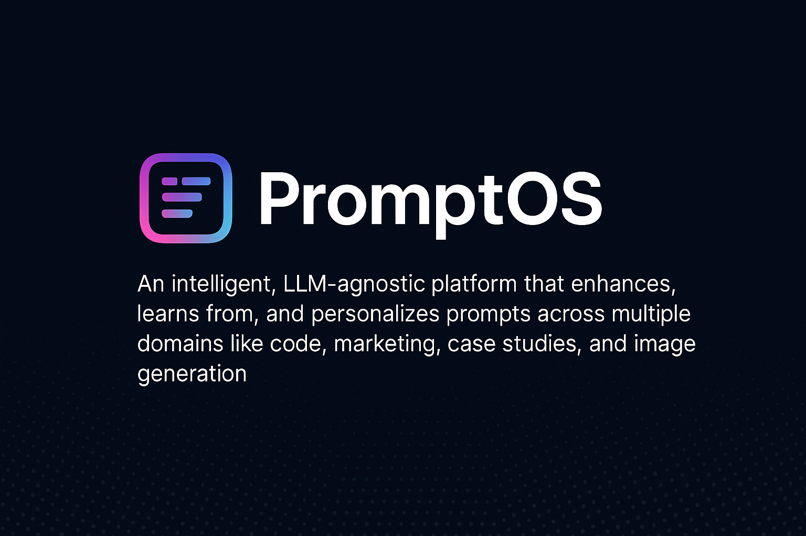

<!-- Project Banner -->

  

<h1 align="center">🚀 PromptOS</h1>

  An intelligent, LLM-agnostic platform that enhances, learns from, and personalizes prompts across multiple domains.

  
  
  
  

---

## ⭐ Vision

PromptOS is a centralized prompt intelligence system that understands, evolves, and adapts. Acting as a Prompt Operating System, it continuously improves using user feedback and reinforcement learning — with **Gemini 2.0 Flash** as the core engine.

---

## ✨ Features

### ⚡ Intelligence & Enhancement
- **Auto-Enhancement**: Instantly rewrite vague prompts into structured, high-performing versions using Gemini 2.0.
- **Prompt Scoring**: Get objective scores (0-10) on **Clarity**, **Specificity**, **Relevance**, and **Model Fit**.
- **LLM Comparison**: Compare your original prompt against the enhanced version side-by-side.

### 🛠️ Workflow & Management
- **Version Control**: Every edit is saved. Rollback to any previous version of your prompt instantly.
- **Prompt Library**: A centralized dashboard to search, filter, and manage all your prompts.
- **Analytics**: Track your prompt creation habits and quality improvements over time.

---

## 🎯 Use Cases

| Use Case                                 | How PromptOS Helps                                                  |
| ---------------------------------------- | ------------------------------------------------------------------- |
| **Code Review**                          | Rewrite "fix this code" into detailed context-aware instructions.   |
| **Marketing Copy**                       | Inject tone, emotional hook, and keyword constraints automatically. |
| **Image Generation**                     | Expand short concepts into vivid, descriptive visual prompts.       |
| **Learning & Study**                     | Structure vague topics into Socratic study plans and flashcards.    |

---

## 🛠 Tech Stack

- **Framework**: Next.js 15 (App Router) with TypeScript
- **AI**: Google Gemini 2.0 Flash (via Google Generative AI SDK)
- **Database**: Supabase (PostgreSQL)
- **UI**: Tailwind CSS, Shadcn/UI, Framer Motion

---

## 🤝 Contributing

We welcome contributions! Please check out our [Contribution Guidelines](CONTRIBUTING.md) for details on how to:
- 🛠 Setup your customized environment
- 🐛 Report bugs
- 📝 Write and submit new blog posts

---

## 📄 License

This project is licensed under the MIT License.
