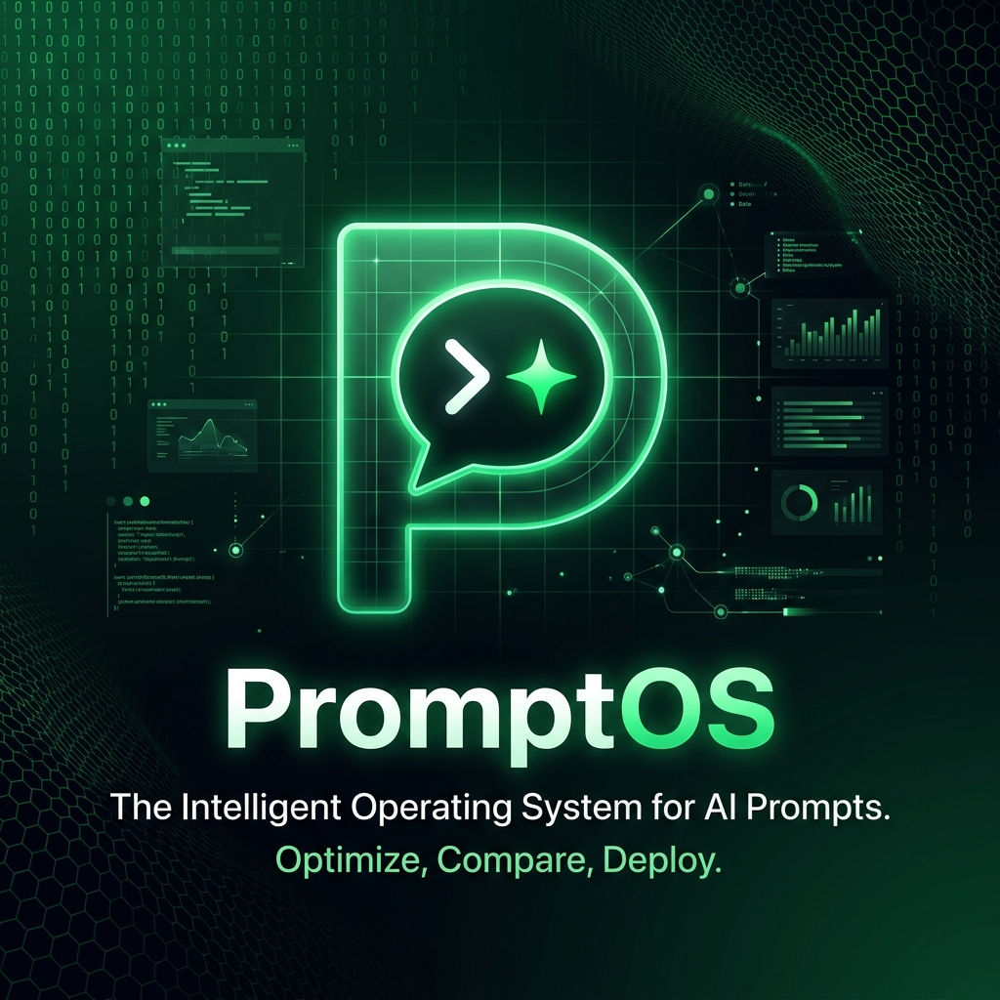

<!-- Project Banner -->

  

<h1 align="center">🚀 PromptOS</h1>

  <strong>The Intelligent Operating System for AI Prompts.</strong> 
  Stop wrestling with AI. Let PromptOS optimize, manage, and execute your prompts for you.

  
  
    

---

## 🛑 The Problem: Prompting is Exhausting

If you use AI regularly, you already know the struggle:

1. **The Blank Page Problem:** You know what you want the AI to do, but translating that into the "perfect prompt" takes 5 tries and 20 minutes of tweaking.
2. **The Lost Prompt:** You finally crafted a brilliant prompt last Tuesday... but you didn't save it. Now it's buried in a sea of chat history.
3. **The Copy-Paste Nightmare:** You want to see if Claude 3 does a better job than GPT-4, so you spend 10 minutes juggling tabs, copy-pasting the same text, and manually comparing the results side-by-side.

## ✨ The Solution: How PromptOS Makes Your Life Easier

PromptOS isn't just another AI wrapper. It is a **centralized workspace** designed specifically to remove the friction from your AI workflows.

### 1. Stop Guessing, Start Generating (Auto-Enhancement)

You don't need to be a "Prompt Engineer." Just type a messy, vague idea like _"write a blog about space,"_ and click a button. PromptOS's internal Gemini engine will instantly rewrite it into a highly structured, context-rich prompt that guarantees incredible results from any LLM.

### 2. Know _Why_ a Prompt is Good (AI Scoring)

Not sure if your prompt is ready? Our intelligent scoring system grades your prompt from 0-100 on **Clarity**, **Specificity**, **Relevance**, and **Model Fit**. It tells you exactly what is missing before you waste time generating a bad response.

### 3. Never Lose a "Good Prompt" Again (Library & Versioning)

Think of PromptOS as GitHub for your AI workflows. Every prompt is saved to your personal library. Every time you tweak a prompt, PromptOS automatically creates a **Version History**. Made a change that ruined the output? Instantly roll back to Version 2 with one click.

### 4. End the Tab-Juggling Madness (Test Playground)

Stop opening 4 different AI websites. Inside the PromptOS playground, you can test your prompt against different LLM architectures right from your dashboard and compare their outputs in a unified interface.

---

## 🎯 Real-World Impact

| You used to...                         | With PromptOS, you now...                                                        |
| :------------------------------------- | :------------------------------------------------------------------------------- |
| Struggle to explain coding bugs to AI. | Click "Enhance" to automatically inject necessary system context.                |
| Lose your favorite marketing prompt.   | Search your Library and pull up the exact version you used last month.           |
| Wonder if your prompt is too vague.    | Look at the 92/100 Clarity Score and deploy with confidence.                     |
| Spend hours testing image prompts.     | Iterate rapidly using Version History to track what changed between generations. |

---

## 📄 License

Copyright (c) 2026 Aditya Trivedi. All rights reserved. This project is proprietary. You are free to view and fork the repository for personal reference and contribution, but redistribution, re-hosting, or modification for commercial deployments is not permitted.
